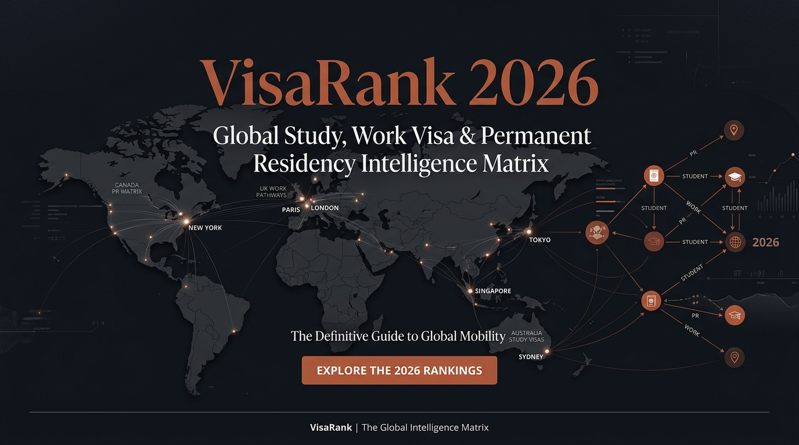

<div align="center">

# VisaRank 🌐

**Next-Gen Global Visa & Immigration Pathway Intelligence Platform**

*Data-driven decision matrix monitoring statutory immigration policies, wage benchmarks, and points-based PR thresholds across 14 developed economies.*

[](https://visarank.net)
[](https://react.dev/)
[](https://www.typescriptlang.org/)
[](https://vitejs.dev/)
[](https://tailwindcss.com/)
[](https://workers.cloudflare.com/)
[](https://developers.cloudflare.com/d1/)
[](LICENSE)
[](https://github.com/)

<br />

[Explore Features](#-key-features) •
[System Architecture](#-system-architecture) •
[Quick Start](#-getting-started) •
[Deployment Guide](#-cloudflare-edge-deployment) •
[API Reference](#-api-specification)

<br />



</div>

---

## 📖 Overview

**VisaRank** is an edge-native intelligence platform designed to eliminate asymmetric information in global migration and study-to-work pathways. Built on top of official statutory legislation gazettes from immigration authorities worldwide (INZ, Home Affairs, IRCC, BAMF, MOJ Japan, etc.), VisaRank computes deterministic scoring trees, wage thresholds, and retention probabilities across **8 career tracks** and **47+ statutory visa categories**.

> *"Same Major. Different Country. Completely Different Destiny."*

---

## 🎯 Key Features

### 1. 🧮 Multi-Dimensional Scoring Engine
- **4-Dimensional Rubric**: Dynamically calculates composite rankings across **Language & Skills Assessment Ease**, **Post-Study Work (PSW) Flexibility**, **Salary Barrier / Median Wage Buffer**, and **Points-Based Invitation Determinism**.
- **Fatal Trap Diagnostics (`FatalTraps`)**: Highlights non-negotiable statutory disqualifiers (e.g., non-accredited employer risks, occupation level mismatch, retroactive median wage shifts).
- **Occupation Code Mapping**: Real-time cross-referencing for **ANZSCO**, **NOC/TEER**, and **BAMF German Shortage Lists**.

### 2. ⚡ Edge-Powered Global Performance
- **Sub-100ms Worldwide Latency**: Built with [Hono.js](https://hono.dev/) and deployed globally via [Cloudflare Workers](https://workers.cloudflare.com/) across 330+ edge locations.
- **Serverless Distributed Storage**: High-concurrency lead capturing and profile persistence utilizing [Cloudflare D1](https://developers.cloudflare.com/d1/) (Edge SQLite).

### 3. 🗺️ Interactive Geographic HUD & D3 Spatial Matrix
- **Lightweight SVG Link-Lines**: High-performance curved trajectory visualization built with `d3-geo`, `topojson-client`, and `framer-motion`.
- **Progressive Disclosure (3-Tier IA)**:
  - **Level 1**: Global Macroeconomic Hall & Zoom-to-Country HUD.
  - **Level 2**: Career Track Comparison Matrix (CS/AI, Engineering, Nursing, etc.).
  - **Level 3**: Full-Viewport Dual-Pane Legislative Interactive Workbench.

### 4. 🔍 Programmatic SEO & Schema.org Microdata
- **Automated XML Sitemap**: Script-driven generation covering 59 dynamic URLs with priority routing.
- **Rich Snippet Readiness**: Embeds standard `GovernmentService` and `FAQPage` JSON-LD schemas to achieve collapsible Q&A rich cards on Google Search.
- **Social Sharing Previews**: Programmatic OpenGraph and Twitter Cards (`summary_large_image`) for high-conversion sharing.

### 5. 🛡️ Zero-Trust Admin & Crowdsourced Governance
- **Master-Secret Authentication**: Lightweight administration dashboard for reviewing anonymous user assessment streams and telemetry.
- **Community Policy Correction Loop**: Crowdsourced legislative feedback inbox allowing applicants to report real-time policy adjustments.

---

## 🏗️ System Architecture

```
                                 [ End Users & Crawlers ]
                                            │
                                            ▼
                           ┌─────────────────────────────────┐
                           │   Cloudflare Edge Global CDN    │
                           │   (Pages / Anycast Routing)     │
                           └────────────────┬────────────────┘
                                            │
               ┌────────────────────────────┴────────────────────────────┐
               ▼                                                         ▼
    ┌─────────────────────────┐                               ┌─────────────────────────┐
    │  React 19 SPA (Client)  │                               │  Cloudflare Worker API  │
    │  - HashRouter Routing   │                               │  - Hono.js Edge Router  │
    │  - react-helmet-async   │ ────── [/api/evaluate] ─────► │  - JsonLogic Evaluator  │
    │  - Framer Motion & D3   │ ◄──── [Match Payloads] ────── │  - Header/IP Telemetry  │
    │  - JSON-LD Injection    │                               │  - /sitemap.xml Handler │
    └─────────────────────────┘                               └────────────┬────────────┘
                                                                           │
                                                                           ▼
                                                              ┌─────────────────────────┐
                                                              │  Cloudflare D1 (SQLite) │
                                                              │  - countries & visas    │
                                                              │  - assessment_records   │
                                                              │  - policy_feedbacks     │
                                                              └─────────────────────────┘
```

### 📁 Monorepo Workspace Structure

```
emigrant-website/
├── shared/                   # Shared TypeScript contracts & schemas
│   ├── src/
│   │   ├── types/            # Country, Visa, Track & Profile interfaces
│   │   ├── schemas/          # Zod validation schemas (Evaluation, Auth, etc.)
│   │   └── data/             # Static reference registries (visas, tracks)
│   └── package.json
│
├── frontend/                 # High-End Editorial Web Client (Vite + React)
│   ├── public/               # Static assets, sitemap.xml, robots.txt, _routes.json
│   ├── src/
│   │   ├── components/       # UI Components (TopNav, Drawer, Maps, Modals, SEOHead)
│   │   ├── pages/            # 3-Tier IA Pages (Home, Track, PathwayDetail, Admin)
│   │   ├── utils/            # seoUtils, Schema.org generators, calculation helpers
│   │   └── services/         # Edge API client
│   └── vite.config.ts
│
├── worker/                   # Serverless Edge Backend (Cloudflare Workers + Hono)
│   ├── src/
│   │   ├── engine/           # Rule evaluation engine
│   │   ├── routes/           # Subrouters (auth, assessments, admin, feedbacks)
│   │   └── utils/            # Edge sitemap & cryptography helpers
│   └── wrangler.toml         # Cloudflare deployment configuration
│
├── d1/                       # Database migrations & seed SQL
│   ├── schema.sql            # Table definitions (countries, visas, occupations)
│   └── seed.sql              # Initial datasets for 14 countries
└── scripts/
    └── generate-sitemap.ts   # Programmatic sitemap generation script
```

---

## 🛠️ Technology Stack

| Layer | Technologies |
| :--- | :--- |
| **Frontend Framework** | React 18/19, TypeScript 5.5, Vite 5 |
| **Styling & Design** | Tailwind CSS, Cormorant Garamond / Newsreader / Inter Fonts |
| **Animations & Spatial** | Framer Motion 11, Lucide Icons, Canvas Confetti, D3 Geo, TopoJSON |
| **Head & SEO Management** | `react-helmet-async`, Schema.org (JSON-LD), Programmatic XML Sitemap |
| **Edge Compute** | Cloudflare Workers, Hono.js 4.6 |
| **Edge Database** | Cloudflare D1 (Serverless Distributed SQLite) |
| **Validation & Logic** | Zod 3.23, JSON-Logic Engine |

---

## 🚀 Getting Started

### Prerequisites

- **Node.js**: `v18.0.0` or later
- **Package Manager**: `npm` (v9+)
- **Cloudflare CLI**: `wrangler` (v3.78+)

### 1. Installation

Clone the repository and install all monorepo dependencies:

```bash
git clone https://github.com/your-username/visarank.git
cd visarank
npm install
```

### 2. Initialize Local Edge Database (D1)

Execute the local SQLite schema and seed dataset:

```bash
npm run d1:local
```

### 3. Start Development Servers

Run the frontend client and worker API simultaneously in separate terminals:

```bash
# Terminal 1: Run Cloudflare Worker Edge API (Port 8787)
npm run dev:worker

# Terminal 2: Run Frontend Vite Dev Server (Port 5173)
npm run dev:frontend
```

Open [http://localhost:5173](http://localhost:5173) in your browser.

---

## 📦 Cloudflare Edge Deployment

### 1. Generate Latest Sitemap

```bash
npm run build:sitemap
```

### 2. Deploy Cloudflare Workers Backend

```bash
cd worker
npx wrangler deploy
```

### 3. Deploy Cloudflare Pages Frontend

```bash
# Build the production bundle
npm run build --workspaces

# Deploy distribution directory to Cloudflare Pages
npx wrangler pages deploy frontend/dist --project-name=visarank
```

### 4. Remote D1 Database Initialization (First-Time Setup)

```bash
npx wrangler d1 execute emigrant_db --remote --file=./d1/schema.sql
npx wrangler d1 execute emigrant_db --remote --file=./d1/seed.sql
```

---

## 🔌 API Specification

| Method | Endpoint | Description | Auth Required |
| :--- | :--- | :--- | :---: |
| `GET` | `/api/countries` | Retrieve active destination countries and metadata | No |
| `GET` | `/api/visas` | Query statutory visa pathways filtered by `countryCode` | No |
| `GET` | `/api/occupations` | Search shortage occupations across ANZSCO/NOC/SOC | No |
| `POST` | `/api/evaluate` | Execute 6-dimensional profile assessment | No |
| `POST` | `/api/assessments` | Persist user assessment snapshot | Optional |
| `GET` | `/api/admin/overview` | Query global telemetry & lead records | **Master Key** |
| `GET` | `/api/admin/export/csv`| Stream full assessment history as CSV file | **Master Key** |
| `GET` | `/sitemap.xml` | Edge-streamed dynamic sitemap XML | No |
| `GET` | `/robots.txt` | Edge-streamed search crawler directives | No |

---

## 📜 Regulatory Disclaimer

> [!IMPORTANT]
> **VisaRank** is an independent research and decision-support tool. It does not represent any government agency or official immigration authority. Assessment scores are generated based on publicly accessible statutory immigration gazettes (v2026.1). Users should consult accredited legal counsel (MARA / LIA / RCIC) before making final legal or financial decisions.

---

## 📄 License

This project is licensed under the [MIT License](LICENSE).

<div align="center">

Crafted with precision for global explorers. © 2026 **VisaRank Intelligence Matrix**.

</div>
